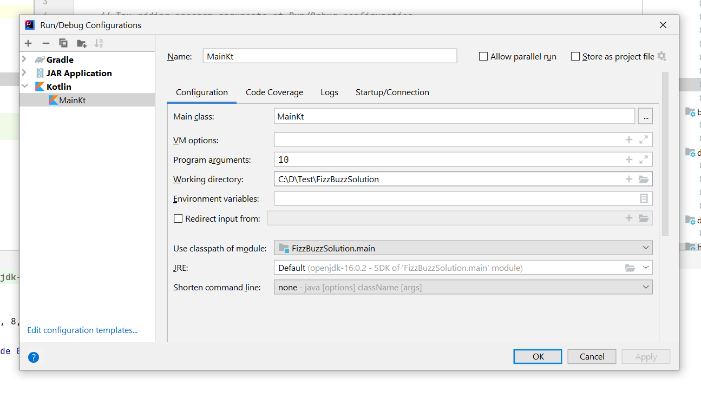

# fizzbuzzKt
This is kotlin solution of [fizz buzz problem](https://en.wikipedia.org/wiki/Fizz_buzz)

# Usage

If using intelliJ you can directly execute Main.kt class which will use input value as 100 as default. 

If you want to override it you can do it via program arguments by editing the configuration like below

 
## via command line

1. execute the gradle jar task.
2. go to build/lib
3. execute `java -jar java -jar FizzBuzzSolution-1.0-SNAPSHOT.jar` it will print the result for input = 100
4. If you want to change the input then execute above command with an argument `java -jar FizzBuzzSolution-1.0-SNAPSHOT.jar 50` it will print the result for input = 50